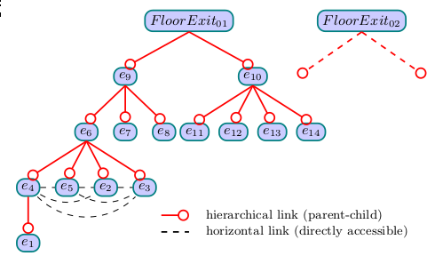

% Fiche de lecture  
Algorithms for continuous location-dependent and context-aware queries in indoor environments
% International Conference on Advances in Geographic Information Systems -- 2012
% Imad Afyouni, Cyril Ray, Sergio Ilarri et Christophe Claramunt

# Résumé

L'article présente des algorithmes pour calculer de façons continuels le plus
court chemins entre deux objets statiques ou mouvants à l'intérieur d'un
bâtiment.

**Mots-clefs** : Espace, Graphes, Algorithmes



# Modélisations

L'idée est d'utiliser plusieurs granularités pour décrire l'espace. On rend
aussi les sorties explicite qu'on hiérarchise pour trouver comment passer d'un
espace à l'autre

# Commentaires

J'ai pas très bien compris l'article à vrai dire :(

# Bibtex

```
@inproceedings{afyouni2012algorithms,
  title={Algorithms for continuous location-dependent and context-aware queries
  in indoor environments},
  author={Afyouni, Imad and Ray, Cyril and Ilarri, Sergio and Claramunt,
  Christophe},
  booktitle={Proceedings of the 20th International Conference on Advances in
  Geographic Information Systems},
  pages={329--338},
  year={2012},
  organization={ACM}
}
```

```
/home/stephane/Documents/Stage 2018/Biblio/Biblio de géraldine/ARTICLES/SPATIAL/S--GRAPH--Algorithms_for_Continuous_Location-dependent_and_Context-aware_Queries_in_Indoor_Environments_AFYOUNI_2012.pdf
```
