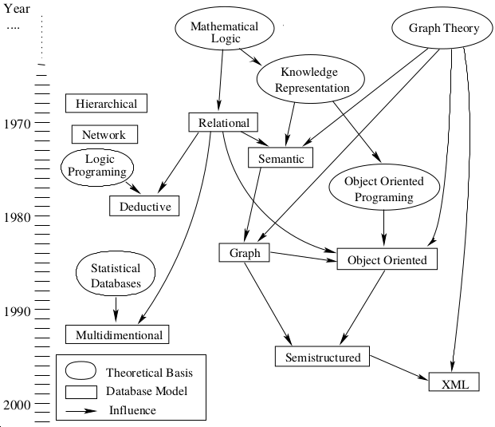

% Fiche de lecture  
Survey of Graph Database Models
% ACM Computing Surveys --2008
% Renzo Angles et Claudio Gutierrez

# Résumé

Enquête sur les différentes base de données en graphes. Donne une définition de
ceux-ci.

**Mots-clefs** : Graphes, Base de données



# Modélisations

Un _db-modele_ et composé de trois choses :

* Une collection de structures de données

* Une collection opérateurs et de règles d'inférence (?)

* Une collection de règles d'intégrité

# Commentaires

Pas réussi à tout lire c'est un peu long, et difficile à lire avec toutes les
références.

# Bibtex

```
@article{angles2008survey,
  title={Survey of graph database models},
  author={Angles, Renzo and Gutierrez, Claudio},
  journal={ACM Computing Surveys (CSUR)},
  volume={40},
  number={1},
  pages={1},
  year={2008},
  publisher={ACM}
}
```

```
/home/stephane/Documents/Stage 2018/Biblio/Survey_of_Graph_Database_Models_ANGLES_2008.pdf
```
