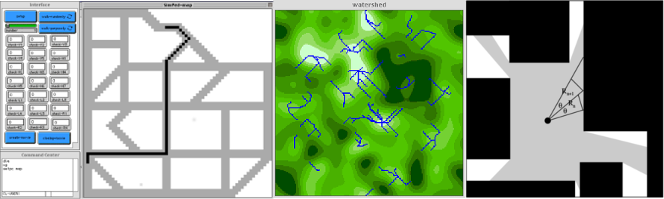

% Fiche de lecture  
Multi-Agent Simulation: New Approaches to Exploring Space-Time Dynamics within GIS
% Centre for Advanced Spatial Analysis -- 1999
% Michael Batty et Bin Jiang

# Résumé

Michael Batty présente dans cette article des méthodes pour explorer l'espace
avec des automates cellulaires. Il montre comment faire des algorithmes de plus
court chemin, de la simulation de ruisselement et de la détermination de champ
de vision.

**Mots-clefs** : Automates cellulaires ; GIS ; Multi-Agents



# Modélisations 

Ici, l'espace est modélisé par une matrice de pixels pouvant prendre plusieurs
valeurs. Les agents ne représente pas des personnes, mais sont là uniquement
pour "distribuer" les calculs.

# Commentaires

Est-ce que la représentation de l'espace en matrice de pixel ça fairerai avancer
le schmilblick ? Je sais pas trop... À part ça il y a pas grand chose à tirer
de cette article.

# Bibtex

```
@article{batty1999multi,
  title={Multi-agent simulation: new approaches to exploring space-time dynamics in GIS},
  author={Batty, Michael and Jiang, Bin},
  year={1999},  
  publisher={Centre for Advanced Spatial Analysis (UCL)}
}
```

```
/home/stephane/Documents/Stage 2018/Biblio/Multi-agent_Simulation_New_Approaches_to_Exploring_Space-time_BATTY_1999.pdf
```
