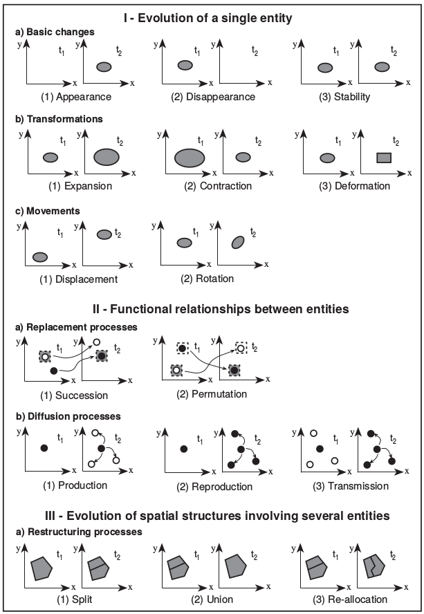

% Fiche de lecture  
Managing time in GIS  
An event-oriented approach
% Recent advances in temporal databases -- 1995
% Christophe Claramunt et Marius Thériault

# Résumé

Le but de cette article est de proposer un GIS avec une intégration du temps, un
TGIS. Pour ce faire Christophe Claramunt défini ce qu'est un évènements ("events
are things that happen"), et les processus. En faite, les évènements sont le
résultat des processus.

**Mots-clefs** : Espace, Temps, GIS

# Modélisations

Bon, il y a tout un truc sur la modélisation en base de données, mais j'ai pas
lu en détails.

# Commentaires

De cet article, il faut surtout retenir la classification des processus.

# Bibtex

```
@incollection{claramunt1995,
  title={Managing time in GIS an event-oriented approach},
  author={Claramunt, Christophe and Th{\'e}riault, Marius},
  booktitle={Recent advances in temporal databases},
  pages={23--42},
  year={1995},
  publisher={Springer}
}
```

```
/home/stephane/Documents/Stage 2018/Biblio/Biblio de géraldine/ARTICLES/TEMPOREL/T--SIG--Managing Time_in_GIS_An_Event-Oriented_Approac_CLARAMUNT_1995.pdf
```


