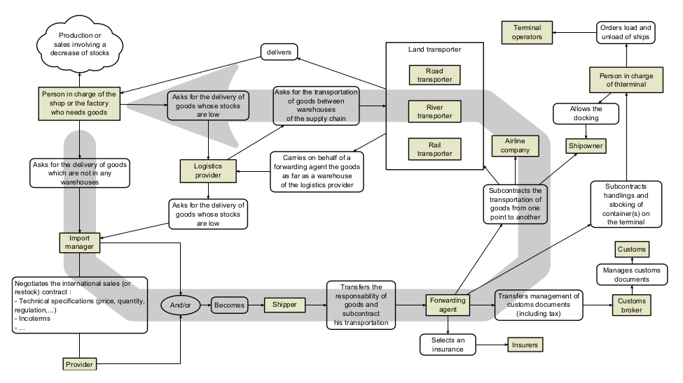

% Fiche de lecture  
Agent-Based Approach and Dynamic Graphs to Model Logistic Corridor
% Procedia Computer Science -- 2015
% Thibaut Démare and Cyrille Bertelle and Antoine Dutot and Laurent Lévêque

# Résumé

Dans ce papier, l'auteur veut modéliser, par une approche multi-agents, la
gestion des stocks et les chaines d'approvisionements. 



# Modélisations 

* **Espace** : Comme les chaines appoviosionements sont constitués de plusieurs
réseaux : maritime ; ferrovière ; routier. De fait, la modélisations est
multi-échelle. Mais l'auteur ne détaille pas comment il a modéliser cela

* **Temps** : Pas précisé

* **Connaissance** : Nada

# Commentaires

J'ai l'impression q'il ne détaille pas bien le modèle, ou alors j'ai pas compris :(

# Bibtex
```
@article{DEMARE2015968,
title = "Agent-based Approach and Dynamic Graphs to Model Logistic Corridor",
journal = "Procedia Computer Science",
volume = "52",
pages = "968 - 973",
year = "2015",
note = "The 6th International Conference on Ambient Systems, Networks and Technologie
s (ANT-2015), the 5th International Conference on Sustainable Energy Information Tech
nology (SEIT-2015)",
issn = "1877-0509",
doi = "https://doi.org/10.1016/j.procs.2015.05.174",
url = "http://www.sciencedirect.com/science/article/pii/S1877050915009746",
author = "Thibaut Démare and Cyrille Bertelle and Antoine Dutot and Laurent Lévêque",
keywords = "agent-based model, dynamic graph, logistic system, modelling, complex sys
tem, geographical information system"
}
```

Chemin vers le fichier : biblio\ de\ geraldine/ARTICLES/SPATIAL_ET_TEMPOREL/\
ST--AGENT--GRAPH--Agent-based_Approach_and_Dynamic_Graphs_to_Model_Logistic_\
Corridor_DEMARE_2015.pdf
