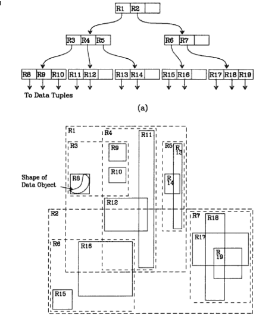

% Fiche de lecture  
R-trees: A dynamic index structure for spatial searching
% SIGMOD -- 1984
% Antonn Guttman

# Résumé

Dans cet article Antonn Gutmann présente un index permettant de d'accéder
rapidement à des objets spatiaux multidimensionnels. L'idée de base est de
grouper les objets par paquets dont le rectangle recouvrant les paquet est le
plus petit.

**Mots-clefs** : Espace, Index

# Modélisations

Pour créer l'index on procède comme ceci :

Pour chaque objet, on trouve le plus petit rectangle recouvrant totalement
l'objet.  Ensuite, on regroupe les rectangles par paquets (en bornant la taille
des paquets), et on trouve les plus petit rectangles recouvrant totalement les
paquets. On recommence jusqu'à qu'il n'y ai plus qu'un seul paquet.

# Commentaires

Ca peut être utile si jamais je fais une modélisations où les données spatiales
sont localisés.

# Bibtex

```
@article{Guttman:1984:RDI:971697.602266,
  author = {Guttman, Antonin},
  title = {R-trees: A Dynamic Index Structure for Spatial Searching},
  journal = {SIGMOD Rec.},
  issue_date = {June 1984},
  volume = {14},
  number = {2},
  month = jun,
  year = {1984},
  issn = {0163-5808},
  pages = {47--57},
  numpages = {11},
  url = {http://doi.acm.org/10.1145/971697.602266},
  doi = {10.1145/971697.602266},
  acmid = {602266},
  publisher = {ACM},
  address = {New York, NY, USA},
}
```

```
/home/stephane/Documents/Stage 2018/Biblio/r-tree_GUTTMAN_1984.pdf
```


