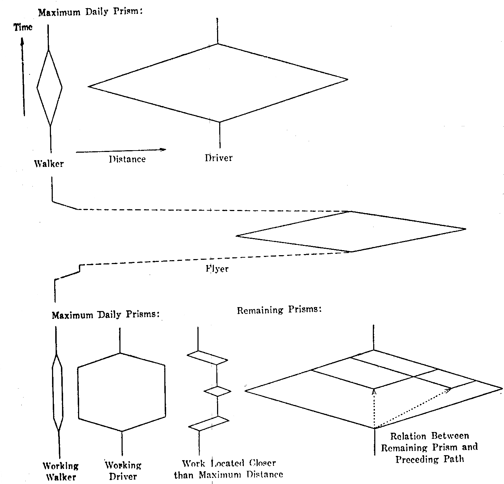

% Fiche de lecture  
What about people in regional science?
% European congress of the regional science association -- 1970
% Torsten Hägerstrand

# Résumé

Partant du constat que les modélisations ne traitent jamais les individus en
tant qu'individus mais en tant que membre de foules, Torsten Hagerstrand
propose de modéliser les itinéraires des individus.

**Mots-clefs** : Espace, Temps

{height=7cm}

# Modélisations 

L'idée est d'utiliser des graphes en 3 dimensions, 2 servent à représenter
l'espace tandis que la troisième sert à représenter le temps.

Les itinéraires sont donc des chemins partant du plan du bas et allant vers
le haut.

Torsten Hägerstrand ne s'arrête pas là. Il montre qu'en considérant les
contraintes, comme dormir ou manger, et les latitudes de déplacements, on peut
définir des prismes qui montrent l'espace où pourrait être l'individus.



Il définit aussi d'autres principes tels que les domaines où les individus sont
maitres des autres individus, ou bien des _bundle_ où les individus se
rejoignent.

# Commentaires

# Bibtex

```
@inproceedings{hagerstrand1970people,
  title={What about people in regional science?},
  author={H{\"a}gerstrand, Torsten},
  booktitle={Papers of the Regional Science Association},
  volume={24},
  number={1},
  pages={6--21},
  year={1970},
  organization={Springer}
}
```

```
/home/stephane/Documents/Stage 2018/Biblio/What about people in regional science_HAGERSTRAND_1970.pdf
```
