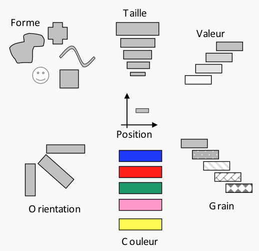

% Fiche de lecture  
Amélioration de la Représentation Cartographique des Phénomènes Urbains
% Thèse -- 2017
% Thi Thu Ha Pham

# Résumé

Le but de cette thèse est de présenter un moyen d'améliorer les cartes

**Mots-clefs** : Espace, Cartographie

{height=7cm}

# Modélisations 

# Commentaires

Hmmm... Rien de bien intéressant en fait.

# Bibtex

```
@phdthesis{thu2017amelioration,
  title={Am{\'e}lioration de la repr{\'e}sentation cartographique des ph{\'e}nom{\`e}nes urbains},
  author={thu ha Pham, Thi and others},
  year={2017},
  school={Paris Est}
}
```

```
/home/stephane/Documents/Stage 2018/Biblio/Amélioration_de_la_Représentation_Cartographique_des_Phénomènes_Urbains_HAPHAM_2017.pdf
```
