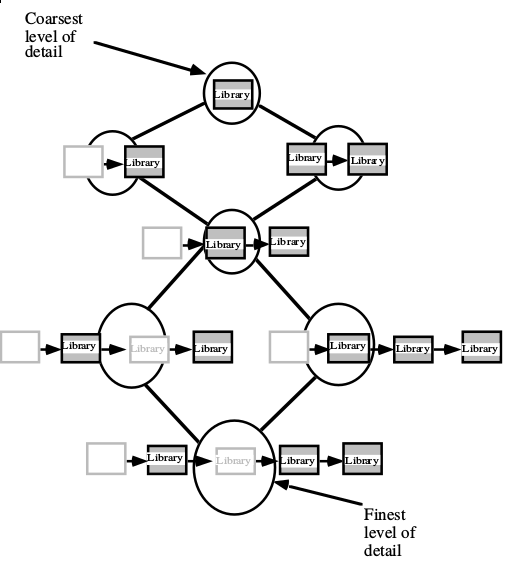

% Fiche de lecture  
Shifts in Detail Through Temporal Zooming
% Tenth International Workshop on Database and Expert Systems Applications -- 1999
% Kathleen Hornsby and Max J. Egenhofer

# Résumé

Kathleen Hornsby propose un modèle pour décrire la ganularité temporel.

**Mots-clefs** : Temps, Granularité



# Modélisations 

Dans ce modèle, chaque transistions entre deux état est explicite. À un niveau
de détail plus petit, on "saute" certains états.

# Commentaires

Ça ressemble beaucoup à de la granularité spatial, mais en une seule
dimensions, rien de foufou

# Bibtex

```
@inproceedings{hornsby1999shifts,
  title={Shifts in detail through temporal zooming},
  author={Hornsby, Kathleen and Egenhofer, Max J},
  booktitle={Database and Expert Systems Applications, 1999. Proceedings. Tenth International Workshop on},
  pages={487--491},
  year={1999},
  organization={IEEE}
}
```

```
/home/stephane/Documents/Stage 2018/Biblio/Biblio de géraldine/ARTICLES/TEMPOREL/T--MULTI--shifts_in_detail_through_temporal_zooming_HORNSBY_1999.pdf
```
