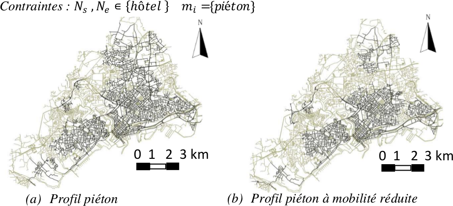

% Fiche de lecture  
Un système de génération d'itinéraires des activités mobiles dans la ville
% SAGEO -- 2015
% Ines Jguirim, David Brosset et Christophe Claramunt

# Résumé

Dans cet article Ines Jguirim décrit un système de génération d'itinéraires.
C'est à dire un système qui pour un réseau routier, un réseau de transport, un
ensemble de point d'intérêts et un profile de piéton, donne l'ensemble des
itinéraires qui permettent au piéton de faire ces activités en considérant sa
vitesse et moyens de transports.

**Mots-clefs** : Espace, Temps, Graphes



# Modélisations

La carte est un graphe où les nodes sont les intersections et les arêtes sont
les rues reliant ces intersections. Les moyens de transports sont des listes
reliant les stations. Les points d'intérêts sont notés sur les nodes.

Pour trouver les itinéraires, l'algorithme explore tous les chemins possible
couvrant les points d'intérêts, et respectant les contraintes du piéton.

# Commentaires

À lire après : Hägerstrand, 1976

# Bibtex

```
@inproceedings{jguirim2015,
  title={Un Syst{\`e}me de G{\'e}n{\'e}ration d'Itin{\'e}raires des activit\'es
  mobiles dans la ville.},
  author={Jguirim, Ines and Brosset, David and Claramunt, Christophe},
  booktitle={SAGEO},
  pages={46--59},
  year={2015}
}
```

```
/home/stephane/Documents/Stage 2018/Biblio/Biblio de géraldine/ARTICLES/SPATIAL_ET_TEMPOREL/ST--GRAPH--Un_Systeme_de_generation_dItineraires_des_activites_mobiles_dans_la_ville_JGUIRIM_2015.pdf
```
