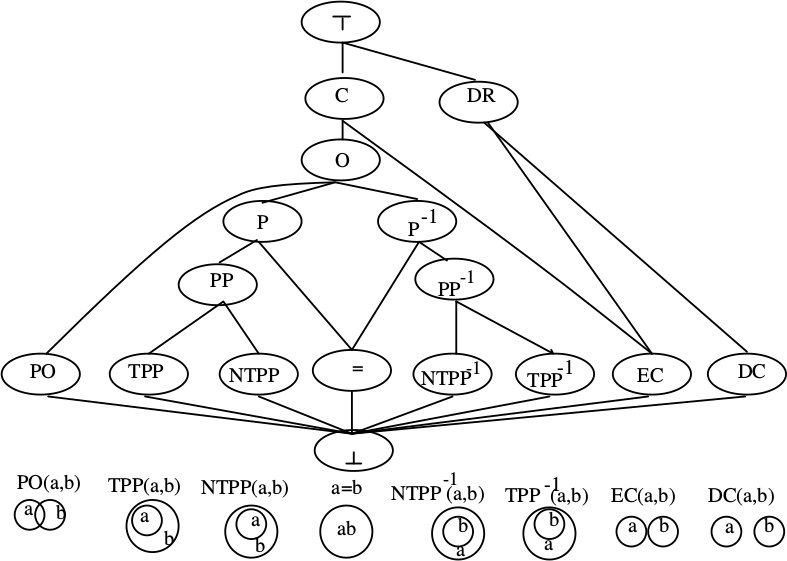

% Fiche de lecture  
A Spatial Logic based on Regions and Connection
% 3rd international conference on Knowledge Representation and Reasoning -- 1992
e David A. Randell, Zhan Cui and Anthony G. Cohn

# Résumé

David A. Randell pose les bases axiomatiques d'une théorie pour décrire
l'espace.

**Mots-clefs** : Espace, Théorie



# Modélisations

- Les objets de bases sont les régions

- La relation de base est la _connection_, on voir C(x, y) comme "La région x
  et y ont un point en commun.

- À partir de là, on peut poser une chiée de relations, et en tirer pleins de
  théorèmes.

# Commentaires

Le treillis des relations entre régions est pas mal. C'est utilisé dans beaucoup
d'autres articles.

# Bibtex

```
@article{randell1992spatial,
  title={A spatial logic based on regions and connection.},
  author={Randell, David A and Cui, Zhan and Cohn, Anthony G},
  journal={KR},
  volume={92},
  pages={165--176},
  year={1992}
}
```

```
/home/stephane/Documents/Stage 2018/Biblio/Biblio de géraldine/ARTICLES/SPATIAL/S--spatial_logic_based_on_regions_and_connections_RANDELL_1992.pdf
```
