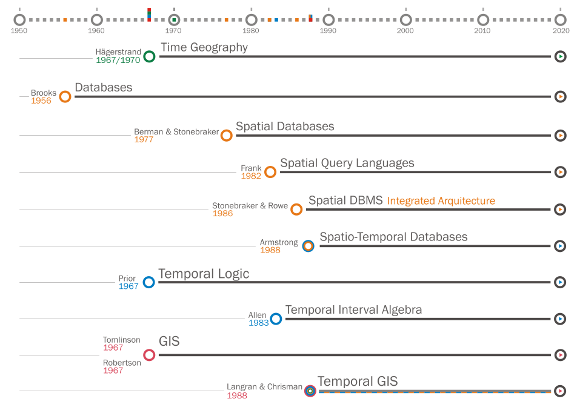

% Fiche de lecture  
A survey of modeling trends in temporal GIS
% ACM Computing Surveys -- 2018
% Willington Siabato, Christophe Claramunt et Sergio Ilarri

# Résumé

C'est une étude de tous les travaux fait sur les Temporal Geographic Information
Systems (T-GIS) dans les dernières années.

**Mots-clefs** : Espace, Temps, GIS



# Modélisations

Les T-GIS naissent de la croisées de plusieurs domaines : Les bases de donnés
(spatial) ; la logic et l'algèbre temporel ; et les GIS.

# Commentaires

# Bibtex

```
@article{siabato2018,
  title={A Survey of Modelling Trends in Temporal GIS},
  author={Siabato, Willington and Claramunt, Christophe and Ilarri, Sergio and
  Manso-Callejo, Miguel {\'A}ngel},
  journal={ACM Computing Surveys (CSUR)},
  volume={51},
  number={2},
  pages={30},
  year={2018},
  publisher={ACM}
}
```

```
/home/stephane/Documents/Stage 2018/Biblio/A_Survey_of_Modelling_Trends_in_Temporal_GIS_SIABATO_2017.pdf
```
