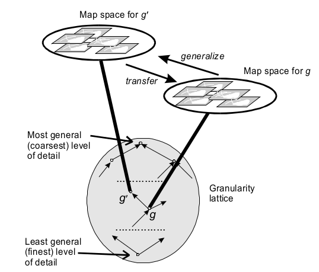

% Fiche de lecture  
Stratified Map Spaces  
A Formal Basis for Multi-resolution Spatial Databases
% Bouquin -- 1998
% John Stell and Michael Worboys

# Résumé

Dans ce papier, John Stell présente une théorie pour modéliser les différentes
échelles de précisions géographique et sémantique qu'on peut avoir dans une
même base de donnés. Il explique comment les organiser et passer d'une à
l'autre.

**Mots-clefs** : Granularité, Espace, Théorie

{height=7cm}

# Modélisations

Deux caractéristiques d'un jeu de données :

- _extent_ est la largeur des donnés, la taille de l'espace modélisé

- _granularity_ est la taille de la plus petite donnés, la précision en somme

Dans une _stratified map space_ on a plusieurs _map_ avec plusieurs niveau de
détails. Les _maps_ sont triés selon un ordre partiel sur leurs niveau de
détails.  On peut passer d'un niveau de détail avec les fonctions Gen et Lift.

Un point assez puissant : on peut tout aussi bien appliquer les principes de
granularité et de _stratified map space_ à des caractéristique géographique
qu'à des caractéristique sémantiques (voir l'exemple dans le papier).

On peut aussi définir des régions vague. C'est à dire des fonction où chaque
point est soit _in_, _out_ ou _maybe_.

# Commentaires

C'est une bonne base théorique.

# Bibtex

```
@INPROCEEDINGS{Stell98stratifiedmap,
  author = {John Stell and Michael Worboys},
  title = {Stratified Map Spaces: A Formal Basis for Multi-resolution Spatial
  Databases},
  booktitle = {SDH'98 Proceedings 8th International Symposium on Spatial Data
  Handling, pages 180--189. International Geographical},
  year = {1998},
  pages = {180--189}
}
```

```
/home/stephane/Documents/Stage 2018/Biblio/Stratified_Map_Spaces_STELL_1998.pdf
```
