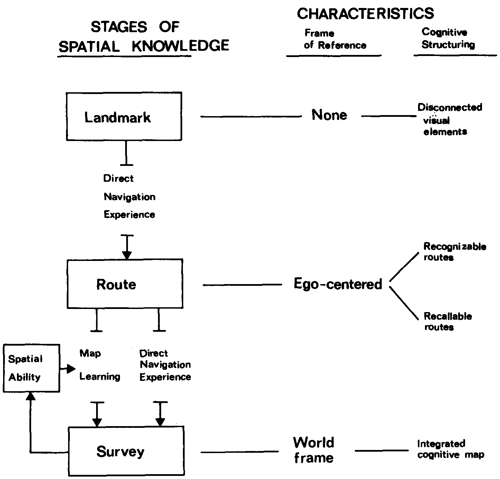

% Fiche de lecture  
Levels Of Spatial Knowledge and Urban Travel Modeling
% Source -- 1988
% Eliahu Stern et David Leiser

# Résumé

Stern décrit ici comment il a interviewé des conducteurs de différents niveaux
(professionnels ou amateurs) pour mettre en évidence les différences dans leurs
connaissance de la ville. Il montre qu'il y a trois niveaux de connaissance, et
fait ressortir les différences de performances entre ceux-ci

**Mots-clefs** : Cognitif ; Connaissance ; Espace

{height=7cm}

# Commentaires

Bon, c'est pas trop dans le thème. En fait il n'a pas du tout fait de
modélisation de l'espace, simplement une catégorisation du niveau de
connaissance.

# Bibtex

```
@article{stern1988,
  author = {Stern, Eliahu and Leiser, David},
  title = {Levels of Spatial Knowledge and Urban Travel Modeling},
  journal = {Geographical Analysis},
  volume = {20},
  number = {2},
  pages = {140-155},
  doi = {10.1111/j.1538-4632.1988.tb00172.x},
  url = {https://onlinelibrary.wiley.com/doi/abs/10.1111/j.1538-4632.1988.tb00172.x},
  eprint = {https://onlinelibrary.wiley.com/doi/pdf/10.1111/j.1538-4632.1988.tb00172.x},
  year= {1988}
}
```

```
/home/stephane/Documents/Stage 2018/Biblio/Levels_of_Spatial_Knowledge_and_Urban_Travel_Modeling_STERN_1988.pdf
```
