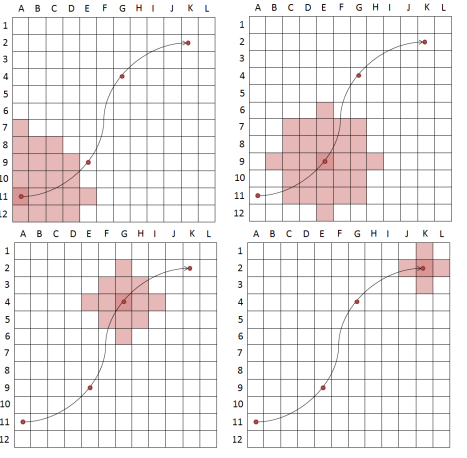

% Fiche de lecture  
Formalisation spatio-temporelle de perturbations maritimes pour la simulation du réseau maritime
% Sageo -- 2016
% Martin Tanguy, Aldo Napoli

# Résumé

Dans cet article, l'auteur explique les difficultés à modéliser les pertubations
maritimes et propose un moyen de  surmonter ces difficultés.

{ height=7cm }

# Modélisations 

* **Espace** : Comme on se trouve sur la mer, l'espace est une grille où les
agents peuvent se déplacer dans toutes les directions.
* **Temps** : Içi le temps est discrétisé en suite d'instant indépendants.
* **Connaisance** : Nada

# Commentaires
L'idée cool, c'est que la parturbation est modélisé comme une diminution de
l'accessibilité des eaux environnantes. Ensuite il suffit d'utiliser un algo
de plus cours chemin prenant ceci en compte, et voilà !

C'est un bon exemple de papier d'explication de modèle. C'est très clair, et
ça va assez loin dans le détail. Je pourrais m'en inspirer.

# Bibtex
```
@inproceedings{tanguy:hal-01417871,
  TITLE = {{Formalisation spatio-temporelle de perturbations maritimes pour l'{\'e}valuation de la vuln{\'e}rabilit{\'e} du r{\'e}seau maritime}},
  AUTHOR = {Tanguy, Martin and Napoli, Aldo},
  URL = {https://hal-mines-paristech.archives-ouvertes.fr/hal-01417871},
  BOOKTITLE = {{SAGEO 2016 - Spatial Analysis and GEOmatics}},
  ADDRESS = {Nice, France},
  ORGANIZATION = {{Analyse Spatiale et des Sciences de l'Information G{\'e}ographique}},
  YEAR = {2016},
  MONTH = Dec,
  KEYWORDS = {Risques maritimes ;  mod{\'e}lisation spatio-temporelle ;  simulation multi-agent},
  PDF = {https://hal-mines-paristech.archives-ouvertes.fr/hal-01417871/file/TANGUY_Martin_SAGEO2016.pdf},
  HAL_ID = {hal-01417871},
  HAL_VERSION = {v1},
}
```
```
/home/stephane/Documents/Stage 2018/Biblio/Biblio de géraldine/ACTES_DE_CONFS/SAGEO_2016/Actes_SAGEO2016.pdf
```
